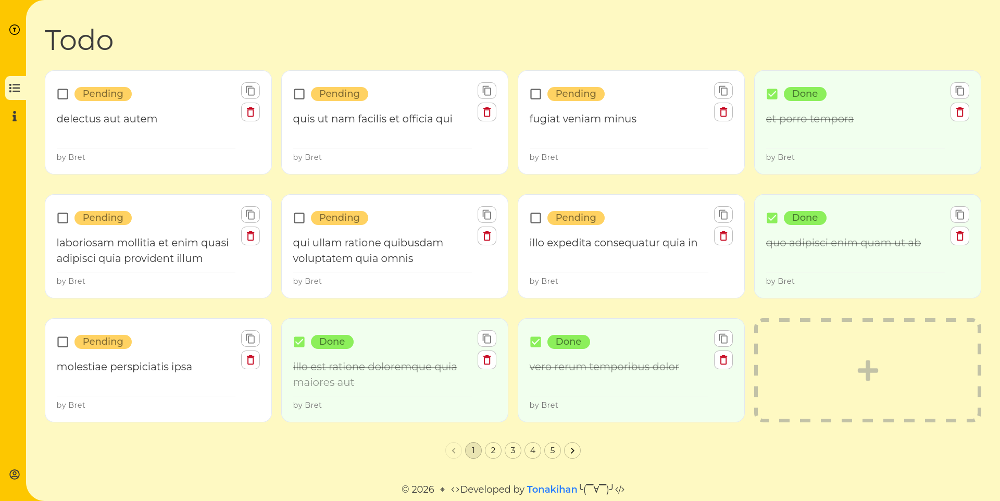

# TODO Client

Цель: обкатка последней версии React. Todo list реализован потому, что 
имелось желание сделать простой красивый и интерактивный frontend на основе Fake API: JSONPlaceholder

## Stack
- Обязательно React последней версии.
- Для такой мелочи добавлю tailwindCSS
- Попробую vite
- Попробовать какую нибудь React UI library
